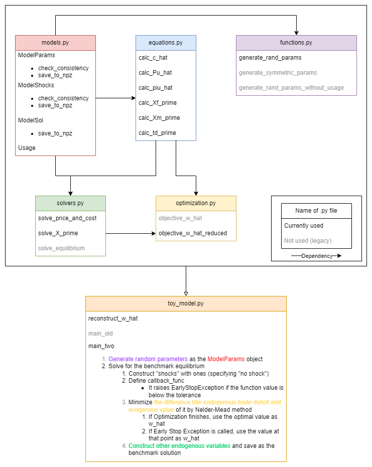

# Volatility Analysis
This project analyzes how economic variables ((real/nominal) wages, price indices, expenditures,...) reacts exogenous productivity shocks and trade cost shocks. The model is an extended version of Caliendo and Parro (2015), which include (i) distinction of final goods intermediate inputs (they have different transportation costs), (ii) analysis of both productivity shocks and trade cost shocks.



## models.py
This file defines classes for model parameters, exogenous shocks, and model solutions. The classes are designed to handle parameter consistency checks, store data, and be used in solving the model.

### ModelParams
ModelParams holds all the core parameters used in the model—such as the number of countries and sectors, expenditure shares, and initial values for wages and labor supply. It also provides the following methods:
- **Consistency Checks**: Ensures parameters align with the model’s theoretical requirements (e.g., that expenditure shares sum to one).
- **Data Storage**: Can save parameters to a file for future reference in a npz file format.

### ModelShocks
ModelShocks stores exogenous shocks—specifically, productivity (lambda_hat) and trade cost shocks (df_hat, dm_hat). It includes the following methods:
- **Consistency Checks**: Verifies that shock values are valid (e.g., positivity, self-trade is not affected by shocks, etc.).
- **Data Storage**: Can save shock variables to a file for future reference in a npz file format.

### ModelSol
ModelSol encapsulates the model’s solution results after applying the model-solving algorithm. This class contains the following methods:
- **Data Storage**: Can save shock variables to a file for future reference in a npz file format.

### Usage
Usage specifies the usage of goods, final consumption or intermediate inputs. This class is used as an input for some functions (to calculate price index changes or expenditure share after the shock, final and intermediate goods sharing the functional form but using different variables)

## equations.py
This file defines model's equations to calculate equlibrium.

### calc_c_hat
Function to calculate unit cost change (equation (7) of the paper).

```math
\hat{c}_{i}^{s} = \hat{w}_{i}^{\beta_{i}^{s}} \prod_{k=1}^{s} \left( \hat{P}_{i}^{km'} \right)^{\beta_{i}^{sk}}
```


### calc_Pu_hat
Function to calculate price index change (equation (8) of the paper).
It requires "usage" as an input (usage = "f" for final goods, = "m" for intermediate inputs)

```math
\hat{P}_{n}^{su} = \left( \sum_{h=1}^{N} \pi_{nh0}^{su} \hat{\lambda}_{h}^{s} \left( \hat{c}_{h}^{s} \hat{d}_{nh}^{su} \right)^{- \theta^{s}} \right)^{- \frac{1}{\theta^{s}}}
```

### calc_pi_hat
Function to calculate expenditure share change (equation (9) of the paper).
It requires "usage" as an input (usage = "f" for final goods, = "m" for intermediate inputs)

```math
\hat{\pi}_{ni}^{su} = \frac{\hat{\lambda}_{i}^{s} \left( \hat{c}_{h}^{s} \hat{d}_{nh}^{su} \right)^{- \theta^{s}}}{\left( \hat{P}_{n}^{su} \right)^{- \theta^{s}}}
```

### calc_Xf_prime
Function to calculate expenditure to the final goods (equation (10) of the paper).

```math
X_{n}^{sf'} = \alpha_{n}^{s} \left[ \hat{w}_{n} w_{n0} L_{n0} + \sum_{s=1}^S \sum_{i=1}^N \frac{\tau_{ni}^{s'}}{1 + \tau_{ni}^{s'}} \left( \pi_{ni}^{sf'} X_{n}^{sf'} + \pi_{ni}^{sm'} X_{n}^{sm'} \right) + TD_{n}^{'} \right]
```

### calc_Xm_prime
Function to calculate expenditure to the intermediate inputs (equation (11) of the paper).

```math
X_{n}^{sm'} = \sum_{k=1}^S \beta_{n}^{ks} \left( \sum_{i=1}^{N} \frac{\pi_{in}^{kf'}}{1 + \tau_{in}^{kf'}} X_{i}^{kf'} + \sum_{i=1}^N \frac{\pi_{in}^{km'}}{1 + \tau_{in}^{km'}} X_{i}^{km'} \right)
```

### calc_td_prime
Function to calculate trade deficit after the shock (equation (12) of the paper).

```math
TD_{n}^{'} = \sum_{s=1}^S \sum_{i=1}^N \left( \underbrace{\frac{\pi_{ni}^{sf'} X_{nt}^{sf'} + \pi_{ni}^{sm'} X_{nt}^{sm'}}{1 + \tau_{ni}^{s'}}}_{\text{Import}} - \underbrace{\frac{\pi_{in}^{sf'} X_{i}^{sf'} + \pi_{in}^{sm'} X_{i}^{sm'}}{1 + \tau_{in}^{s'}}}_{\text{Export}} \right)
```

## solvers.py
This file contains some functions to solve the model using loops.

### solve_price_and_cost
Function to solve c_hat and Pm_hat (inner loop). For any given value of $\{ \hat{w}_n \}$, it calculates $\{ \hat{c}_{n}^{s} \}$ and $\{ \hat{P}_{n}^{s,m} \}$ that simultaneously satisfy equations (7) and (8). It simply uses loops.

### solve_X_prime
Function to solve $\{ X_{n}^{s, f '} \}$ and $\{ X_{n}^{s, m '} \}$. For any given value of $\{ \hat{w}_n \}$, $\{ \hat{\pi}_{ni}^{s, f} \}$, $\{ \hat{\pi}_{ni}^{s, m} \}$, $TD_{n}^{'}$. Takes the initial guess of $\{ X_{n}^{s, f '} \}$ and $\{ X_{n}^{s, m '} \}$ and solve by using loops.

### <span style="color: grey; ">solve_equilibrium</span>
Function to solve the entire equilibrium using loops. It guesses $\{ \hat{w}_n \}$ and calculate endogenous variables and the difference of world-GDP-normalized trade deficit

```math
ZW2_n = \frac{TD_{n}^{'}}{\sum_{i=1}^{N} \hat{w}_{n} w_{n0} L_{n0}} - \frac{TD_{n0}}{\sum_{i=1}^{N} w_{n0} L_{n0}},
```

and updates the guess $\{ \hat{w}_n \}$ by

```math
\hat{w}_{n}^{\text{new}} = \hat{w}_{n}^{\text{old}} \exp \left(-\frac{ZW2_n}{10} \right).
```

It doesn't work for some reason, and is no longer used.

## functions.py
This file defines some utility functions.

### generate_rand_params
Function to randomly generate parameters. Receives the number of countries and sectors and returns the ModelParams object.

### <span style="color: grey; ">generate_symmetric_params</span>
Function to randomly generate parameters, but each country should be identical. Doesn't work for some reason.

### <span style="color: grey; ">generate_rand_params_without_usage</span>
Function to randomly generate parameters, with constraint $\pi_{ni}^{s,f} = \pi_{ni}^{s,m}$.

## optimization.py
This file defines the objective function for the mathematical optimization, which will be used to solve the equilibrium.

### reconstruct_w_hat
Function to reconstruct a $N$-length vector of $\hat{w}_{n}$ from the $(N-1)$-length vector without the numeraire country.

### objective_w_hat_reduced
Function to calculate the normalized trade deficit $ZW2_n$ for countries other than the numeraire country and returns the max-absolute value of the $\{ZW2_n\}$ vector. Used as the objective function for solving equilibrium.

### <span style="color: grey; ">objective_w_hat</span>
Function to calculate $ZW2_n$ for all countries (including numeraire country). No longer used.

